<!-- ╔══════════════════════════════════════════════════════╗ -->
<!-- ║        ABHINAV SUNIL — Premium Developer Profile       ║ -->
<!-- ╚══════════════════════════════════════════════════════╝ -->

<a href="https://github.com/IamAbhinav01">
  <picture>
    <source media="(prefers-color-scheme: dark)" srcset="./dark.svg">
    <source media="(prefers-color-scheme: light)" srcset="./light.svg">
    
  </picture>
</a>

  

 

 

---

<!-- ░░░░░░░░░░  01 — SYSTEM PROFILE  ░░░░░░░░░░ -->

  <picture>
    <source media="(prefers-color-scheme: dark)" srcset="./header_01_dark.svg">
    <source media="(prefers-color-scheme: light)" srcset="./header_01_light.svg">
    
  </picture>

 

  <picture>
    <source media="(prefers-color-scheme: dark)" srcset="./profile_dark.svg">
    <source media="(prefers-color-scheme: light)" srcset="./profile_light.svg">
    
  </picture>

 

---

<!-- ░░░░░░░░░░  02 — TECH ARSENAL  ░░░░░░░░░░ -->

  <picture>
    <source media="(prefers-color-scheme: dark)" srcset="./header_02_dark.svg">
    <source media="(prefers-color-scheme: light)" srcset="./header_02_light.svg">
    
  </picture>

 

  <picture>
    <source media="(prefers-color-scheme: dark)" srcset="./arsenal_dark.svg">
    <source media="(prefers-color-scheme: light)" srcset="./arsenal_light.svg">
    
  </picture>

 

---

<!-- ░░░░░░░░░░  03 — FEATURED PROJECTS  ░░░░░░░░░░ -->

  <picture>
    <source media="(prefers-color-scheme: dark)" srcset="./header_03_dark.svg">
    <source media="(prefers-color-scheme: light)" srcset="./header_03_light.svg">
    
  </picture>

 

<a href="https://github.com/IamAbhinav01/AeroMind-Distributed-Flight-Reservation-System">
  <picture>
    <source media="(prefers-color-scheme: dark)" srcset="./project_0_dark.svg">
    <source media="(prefers-color-scheme: light)" srcset="./project_0_light.svg">
    
  </picture>
</a>
&nbsp;
<a href="https://github.com/IamAbhinav01/coderX">
  <picture>
    <source media="(prefers-color-scheme: dark)" srcset="./project_1_dark.svg">
    <source media="(prefers-color-scheme: light)" srcset="./project_1_light.svg">
    
  </picture>
</a>

  

<a href="https://github.com/IamAbhinav01/RateLimiter">
  <picture>
    <source media="(prefers-color-scheme: dark)" srcset="./project_2_dark.svg">
    <source media="(prefers-color-scheme: light)" srcset="./project_2_light.svg">
    
  </picture>
</a>
&nbsp;
<a href="https://github.com/IamAbhinav01/NimbusCodex">
  <picture>
    <source media="(prefers-color-scheme: dark)" srcset="./project_3_dark.svg">
    <source media="(prefers-color-scheme: light)" srcset="./project_3_light.svg">
    
  </picture>
</a>

  

<a href="https://github.com/IamAbhinav01/KITCHENELITEAI----cullinary-expertise">
  <picture>
    <source media="(prefers-color-scheme: dark)" srcset="./project_4_dark.svg">
    <source media="(prefers-color-scheme: light)" srcset="./project_4_light.svg">
    
  </picture>
</a>
&nbsp;
<a href="https://github.com/IamAbhinav01/Med_Vision">
  <picture>
    <source media="(prefers-color-scheme: dark)" srcset="./project_5_dark.svg">
    <source media="(prefers-color-scheme: light)" srcset="./project_5_light.svg">
    
  </picture>
</a>

 

---

<!-- ░░░░░░░░░░  04 — NEURAL ACTIVITY METRICS  ░░░░░░░░░░ -->

  <picture>
    <source media="(prefers-color-scheme: dark)" srcset="./header_04_dark.svg">
    <source media="(prefers-color-scheme: light)" srcset="./header_04_light.svg">
    
  </picture>

 

&nbsp;&nbsp;

 

 

 

---

<!-- ░░░░░░░░░░  05 — ACHIEVEMENT NODES  ░░░░░░░░░░ -->

  <picture>
    <source media="(prefers-color-scheme: dark)" srcset="./header_05_dark.svg">
    <source media="(prefers-color-scheme: light)" srcset="./header_05_light.svg">
    
  </picture>

 

  

&nbsp;

  

&nbsp;

&nbsp;

 

  
  
  
  
  
  

 

---

<!-- ░░░░░░░░░░  06 — EXPERIENCE & EDUCATION  ░░░░░░░░░░ -->

  <picture>
    <source media="(prefers-color-scheme: dark)" srcset="./header_06_dark.svg">
    <source media="(prefers-color-scheme: light)" srcset="./header_06_light.svg">
    
  </picture>

 

  <picture>
    <source media="(prefers-color-scheme: dark)" srcset="./edu_dark.svg">
    <source media="(prefers-color-scheme: light)" srcset="./edu_light.svg">
    
  </picture>

 

---

<!-- ░░░░░░░░░░  07 — CONTRIBUTION SERPENTINE  ░░░░░░░░░░ -->

  <picture>
    <source media="(prefers-color-scheme: dark)" srcset="./header_07_dark.svg">
    <source media="(prefers-color-scheme: light)" srcset="./header_07_light.svg">
    
  </picture>

 

 

---

<!-- ░░░░░░░░░░  08 — ESTABLISH CONNECTION  ░░░░░░░░░░ -->

  <picture>
    <source media="(prefers-color-scheme: dark)" srcset="./header_08_dark.svg">
    <source media="(prefers-color-scheme: light)" srcset="./header_08_light.svg">
    
  </picture>

 

&nbsp;

&nbsp;

  

  
  
  
  

 

> ### *"Ship fast. Build to scale. Let the systems do the talking."*
> — **Abhinav Sunil** · Full-Stack Engineer · AI Builder

 

